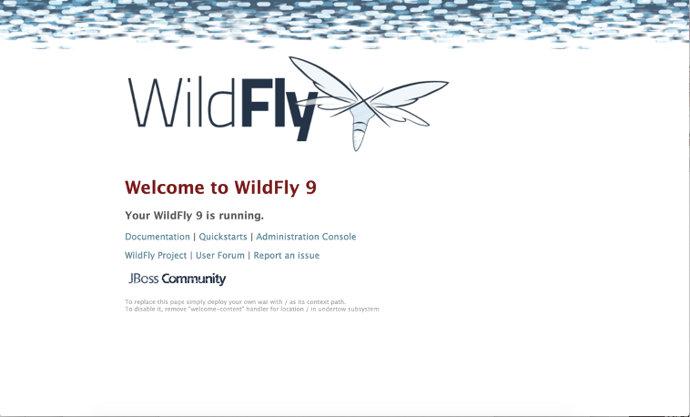
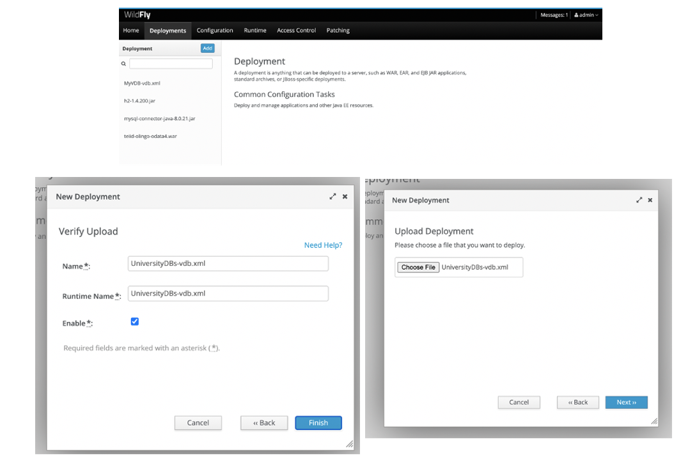

# Ontop with Teiid (Work in Progress for Ontop 4.1.1)

In this tutorial, we present how to use Teiid as a federator for Ontop. We provides two options:

- Option 1: Using Docker-comopse
- Option 2: Manual set up

## Option 1: Using Docker-comopse

### Requirements
* [Docker](https://docs.docker.com/get-docker/), version 17.09.0 or higher
* [Docker Compose](https://docs.docker.com/compose/install/), version 1.17.0 or higher

### Steps

1) to start the prototype, downloading / building the required images and containers if needed
  ```
  docker-compose up
  ```
  (note: may add option `-d` to run in background, in which case logs are not be displayed to standard output but are still accessible via `docker-compose logs`)

**Services** When running, the prototype exposes the following services:

* a PostgreSQL server with the sample data, with connection information defined in the [.env](`.env`) file. 

* a Web portal of the SPARQL endpoint backed by ontop at URL <http://localhost:8880/>
  
* a SPARQL endpoint backed by ontop at URL <http://localhost:8880/sparql> (assuming default port `8880` is used).

2) to stop the prototype, if running
  ```
  docker-compose down
  ```

3) to stop the prototype, if running, and also clean any image / container / data associating to it (useful for cleaning up)
  ```
  docker-compose down --volumes --remove-orphans
  ```
  (note: the above command does not remove Docker images that may result being unused after stopping and removing this prototype containers; to remove such images, add option `--rmi all`)

4) to check the status of the containers forming the prototype
  ```
  docker-compose ps
  ```

5) to check the logs of specific container(s) or of all containers (if no container name is supplied)
  ```
  docker-compose logs <container name 1> ... <contaner name N>
  ```
  
## Option 2: Manual set up

In this tutorial, we present step-by-step way of connecting Teiid to Ontop. We show how to integrate *uni1* data stored in a MySQL DB and *uni2* data stored in a PostgreSQL DB into one Teiid virtual database, and access these two data sources using Ontop in a uniform way. 

### Install Teiid

Download the latest version 16.0.0 of Teiid from <https://teiid.io/teiid_wildfly/downloads/> (choosing Teiid with WildFly/Console, by this way, we do not to install WildFly anymore). Unzip it to a directory, which is denoted as $TEIID-DIR below.

Configure the environment variable 'JBOSS_HOME' of WildFly:
``` 
export JBOSS_HOME=$TEIID_DIR
export PATH=$PATH:$JBOSS_HOME/bin
```
Then start 'WildFly' by executing the following commands:
``` 
 ~ cd $TEIID_DIR/bin/
 ~ bin ./standalone.sh
```
And access <http://localhost:8080/> through your browser. If you see the following Welcome page then 'WildFly' has been installed successfully.



After 'WildFly' has been isntalled, Teiid standalone mode can be started by executing the commands below:
``` 
~ cd $TEIID_DIR/bin/
~ bin ./standalone.sh  -c=standalone-teiid.xml
```

Run 'add-user.sh' (in the directory $TEIID_DIR/bin/) and follow the introduction to respectively add 'Management User' and 'Application User'. 'Management User' is used to administrate your data sources and VDBs via web Console, and 'Application User' is used to connect Teiid Server.  

### Configure data sources

Before building and deploying VDBs of Teiid, we first need to configure the data sources needed to be integerated. First, start Teiid. 

#### Deploy the drivers of the data sources

Access <http://localhost:8080/> through your browser. Click 'Adminitration Console' and login with the management user account you have created. Then do the following steps:
* Click 'Deployments' 
* Click 'Add' 
* Upload the jdbc driver of MySQL, i.e., mysql-connector-java-8.0.21.jar
* Click 'Next' 
* Click 'Fnish'


Then deploy the driver of PostgreSQL, i.e., postgresql-42.2.19.jar, in the same way

#### Configure the data sources

Configure the DB *uni1* of MySQL via the 'Web Console' by the following steps:
* Click 'Configuration'  
* Click 'Subsystems' 
* Click 'Datasources' 
* Click 'Non-XA' 
* Click 'Add' 
* Choose the type of the 'Datasources', i.e., MySQL 
* Click 'Next' 
* Input the Name and JNDI Name of the datasource and click 'Next'. 
  **Please record the name and JNDI name you inout for the source, since they will be used when build VDBs of Teiid**
* Choose the driver of the datasource and click 'Next' 
* Input the connection URL, user name and password of the datasource and click 'Next' 
* Test the connection of the data source and click 'Next' if the connect is sucessful 
* Click 'Finish'


And configure the DB *uni2* of PostgreSQL in the same way. 

#### Build and Deploy VDBs

Create a virtual database (VDB) of Teiid that integartes the MySQL DB *uni1* and PostgreSQL DB *uni2* (the file 'UniversityDBs-vdb.xml' in 'ontop-website/.vuepress/public/tutorial/federation/teiid/data/').
```
<vdb name="UniversityDBs"  version="1">
    <model visible="true" name="uni1">
        <source name="uni1" translator-name="mysql5" connection-jndi-name="java:/MySqlUni1"/>
        <metadata type="DDL"><![CDATA[
                CREATE FOREIGN TABLE student (
                  s_id  integer not null primary key,
                  first_name varchar(40) not null,
                  last_name varchar(40) not null
                  )OPTIONS(UPDATABLE 'FALSE');
                  
                CREATE FOREIGN TABLE academic (
                  a_id integer not null primary key,
                  first_name varchar(40) not null,
                  last_name varchar(40) not null,
                  position integer not null
                 )OPTIONS(UPDATABLE 'FALSE');
                 
                 CREATE FOREIGN TABLE course (
                   c_id integer not null primary key,
                   title varchar(100) not null
                  )OPTIONS(UPDATABLE 'FALSE');
                  
                CREATE FOREIGN TABLE teaching (
                 c_id integer not null,
                 a_id integer not null
                 )OPTIONS(UPDATABLE 'FALSE');
                 
                CREATE FOREIGN TABLE course_registration (
                  c_id integer not null,
                  s_id integer not null
                 )OPTIONS(UPDATABLE 'FALSE');
            ]]> </metadata>   
      </model> 
      <model visible="true" name="uni2">
        <source name="uni2" translator-name="postgresql" connection-jndi-name="java:/PostgresUni2"/>
        <metadata type="DDL"><![CDATA[
                CREATE FOREIGN TABLE person (
                  pid integer not null primary key,
                  fname varchar(40) not null,
                  lname varchar(40) not null,
                  status integer not null,
                  ssn varchar(40) not null unique
                 )OPTIONS(UPDATABLE 'FALSE');
                 
             CREATE FOREIGN TABLE course (
              cid integer not null primary key,
              lecturer integer not null,
              lab_teacher integer not null,
              topic varchar(100) not null
               )OPTIONS(UPDATABLE 'FALSE');
               
             CREATE FOREIGN TABLE registration (
              pid integer not null,
              cid integer not null
              )OPTIONS(UPDATABLE 'FALSE');
            ]]> </metadata>                
    </model>    
  </vdb>
 ```
 Here, "UniversityDBs" is the name of this VDB. The title of this file should be UniversityDBs-vdb.xml. Note that the values of *connection-jdni-names* must be the names used when configure the corresponding data sources. Here, the forgign tables described by DDL are the schemas of the tables in the DB uni1 and the DB uni2. See http://teiid.github.io/teiid-documents/16.0.x/content/reference/as_virtual-databases.html for more information on how to develop VDBs of Teiid. 

Then deploy the VDB *UniversityDBs-vdb.xml* through the 'Web Console' by the following steps:
* Click 'Deployments' 
* Click 'Add' 
* Upload the VDB file 
* Click 'Next' to varify your VDB 
* Click 'Finish' 



By the following steps to see whether the VDB has been deployed successfully:
* Click 'Runtime' 
* Click 'Standalone Server' 
* Click 'Subsystems'
* Choose 'Teiid' and click 'View':


If the 'Statues' of the VDB is 'ACTIVE' then the VDB has been successfully deployed. 

### Configure Ontop-protege to use the VDB of Teiid

Download the JDBC Driver of Teiid from  <https://teiid.io/teiid_wildfly/downloads/>, and put it in a directory. Suppose the path is '$Dir/teiid-16.0.0-jdbc.jar'.

Install the Teiid JDBC driver. Within Protege， clike 'File', 'Reference', 'JDBC Drivers' and 'Add' in turn:

 ```
. Description: Teiid  
. Class name: org.teiid.jdbc.TeiidDriver 
. Driver File (jar): browse to `$Dir/teiid-16.0.0-jdbc.jar` 
```

For the connection, in your Datasource manager, use: 

```
. Connection url: jdbc:teiid:UniversityDBs@mm://localhost:31000 
. Database Username: $var1 
. Database Password: $var2  
. Driver class: org.teiid.jdbc.TeiidDriver
```
    
Here, '$Var1' and '$Var2' are respecrively the user name and passord of your 'Application User' created before.

### Create the ontology and mapping and try some SPARQL queries

You can directly use the files 'university.ttl', 'university.obda' and 'teiid.properties' (in 'ontop-website/.vuepress/public/tutorial/federation/teiid/data/') we have prepared. 

Setup a SPARQL endpoint with Command Line Interface (CLI). 

Configure Ontop CLI by adding the Teiid JDBC driver:

```console
cp $Dir/teiid-16.0.0-jdbc.jar
<OntopInstallationPath>/jdbc
```

Run the Ontop CLI:
```console
ontop endpoint -t university.ttl -m university.obda -p teiid.properties --cors-allowed-origins='*'
```

Access the SPARQL endpoint. Open <http://localhost:8080/>, and run an example SPARQL query ''asking for the courses that are teached at both university1 and university as well as the lectures of such courses in university2':

 ```sparql
PREFIX : <http://example.org/voc#>
PREFIX rdf: <http://www.w3.org/1999/02/22-rdf-syntax-ns#>
PREFIX foaf: <http://xmlns.com/foaf/0.1/>

SELECT ?x ?z ?y ?e 
{?x rdf:type :Course . ?x :title ?y . ?x :isGivenAt <http://example.org/voc#uni1/university> . 
 ?z rdf:type :Course . ?z :title ?y . ?z :isGivenAt <http://example.org/voc#uni2/university> . 
 ?e :givesLecture ?z. }
 ```
 you can obtain the following certain answers which are generated by extracting and merging the data obatined from uni1 and uni2:
 ```
[x z y e]
[x/<http://example.org/voc#uni1/course/1602>,z/<http://example.org/voc#uni2/course/1>,y/"Information security",e/<http://example.org/voc#uni2/person/1>]
[x/<http://example.org/voc#uni1/course/1601>,z/<http://example.org/voc#uni2/course/6>,y/"Intelligent Systems",e/<http://example.org/voc#uni2/person/7>]
```
  
